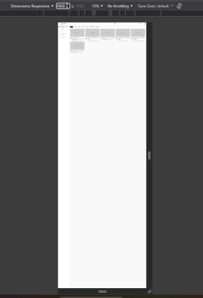
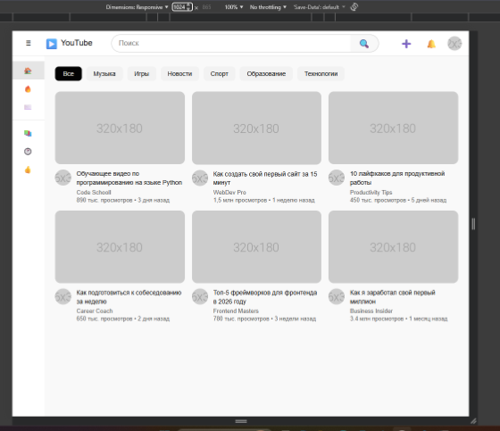
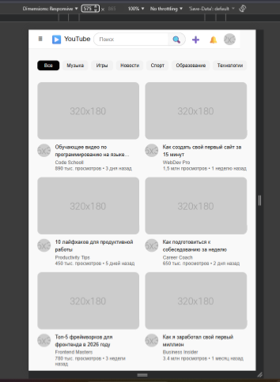
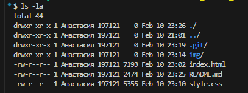

# YouTube Clone - Лабораторная работа №9-10
**Студент:**
Чешуина А.Д., Антонова П.А.
**Группа:**
ИСП-231
## Описание
Адаптивный клон главной страницы YouTube, созданный с использованием HTML, CSS, Flexbox и CSS Grid. Проект имитирует базовый интерфейс YouTube с хедером, сайдбаром, категориями и сеткой видео-карточек. Реализована полная адаптивность под различные устройства.
## Реализованные функции- 
- [x] Адаптивный хедер с поиском
- [x] Боковая панель навигации
- [x] Категории (чипсы) с интерактивностью
- [x] Сетка видео с карточками
- [x] Hover-эффекты на карточках
- [x] Полная адаптивность под все устройства
- [x] Подключение к GitHub и ведение истории коммитов
## Технологии
- HTML5
- CSS3
- Flexbox
- CSS Grid
- Media Queries
## Скриншоты
### Desktop (1920px)

### Tablet (1024px)

### Mobile (375px)

## Как запустить
1. Скачайте или склонируйте проект.
2. Откройте файл `index.html` в браузере.
3. Или используйте **Live Server** в VS Code:
   - Установите расширение "Live Server".
   - Нажмите правой кнопкой на `index.html` и выберите "Open with Live Server".
## Структура проекта

## Вывод
В ходе выполнения лабораторной работы мы освоили создание сложных адаптивных макетов с использованием Flexbox и CSS Grid. Научились реализовывать интерактивные элементы, работать с медиа-запросами для адаптивности, а также вести проект в GitHub.
Проект помог нам лучше понять принципы создания современных веб-интерфейсов.
## Дата выполнения
10.02.2026